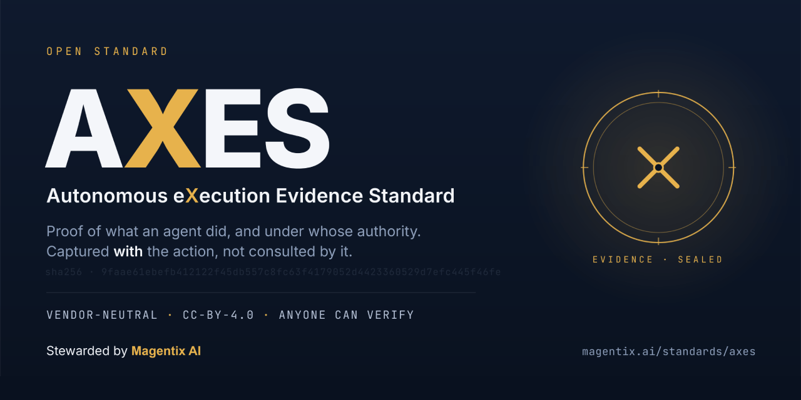

# AXES - Autonomous eXecution Evidence Standard

**SE v0.1 Public Working Draft** · An open, vendor-neutral evidence schema for accountable autonomous execution.

> **Status: Public Working Draft.** This standard is published early, deliberately. Breadth is visible from the first draft; maturity is governed openly. Every element carries a maturity label (`core` … `experimental`), every requirement is traceable in the [requirements register](registers/requirements-register.md), and every deferral or rejection is recorded with its reason in the [decision register](registers/decision-register.md). Nothing here is finished; everything here is governed. See the [ROADMAP](ROADMAP.md).

## Corpus of record

The Golden Trace corpus that external parties have independently verified is tagged **`corpus/2026-08-08-gt-v2`** (commit `776cc0b`).

| Bundle | Chain head | Bundle digest |
|---|---|---|
| `golden-trace` (fin) | `71c10986320fa148ab89c65c3f92a4ddd12ebfaac2db4f9099fa0443ccb0b564` | `b45f7c47c81e06bceddb5694cd2b0f28cd2afd5082e5c1102b217c713d344352` |
| `golden-trace-ind` | `93733e6a8b6f6be299f656ddfb951f13c9da4756f9d37470649ac3414056fba4` | `b926af903de3d5088a253a486044a7fc1bf8afd046958da0054ea152fc7c3463` |

**The default branch currently carries a different, earlier corpus lineage that has not been externally verified.** If you are reproducing published figures, or following a verification result cited in a public thread, check out the tag above. A reconciliation is in progress and is tracked in [`RELEASES.md`](RELEASES.md). Reproduction commands: [`VERIFY.md`](VERIFY.md).

---

## The problem

Autonomous systems - AI agents, orchestrated workflows, delegated processes - now take actions that become real: payments made, records changed, messages sent, infrastructure altered. Today the account of those actions lives in vendor logs: unportable, unsigned, unreadable to the people accountable for them.

Logs answer *"what did the software do?"* for an engineer. They cannot answer, for a board, an auditor, a regulator, an insurer or a court:

- **Who authorised this?** Under what delegation, with what scope and validity?
- **Did anything become real?** Which actions crossed a commit boundary, and were they confirmed by the other side?
- **Can the evidence be trusted?** Is it complete, tamper-evident, independently verifiable - and where are its declared gaps?

AXES defines the missing artefact: the **Standards Envelope (SE)** - an atomic, append-only, hash-chained, signature-ready evidence event, emitted at every meaningful step of an autonomous execution, portable across runtimes and vendors, and sufficient for a competent third party to reconstruct what happened and report on it **without any proprietary tooling**.

## What AXES is - and is not

**It is:** an evidence capture and evidence semantics standard. Envelopes, trace bundles, authority context, commit boundaries, execution topology, evidence quality, assurance assertions, attestation, export manifests.

**It is not:** a logging format, an observability protocol, a policy or blocking engine, an identity system, a payment rail, a runtime, or a compliance certificate. AXES evidences; it never certifies. Conformant evidence supports scoped assurance statements - it does not license claims of "compliant", "safe" or "guaranteed".

## Who this is for

AXES was designed report-backwards from 58 roles across six reader audiences. It is written for the people accountable for an autonomous action, not only the engineers who built the system - and these are roles, not industries: the same envelope serves a SEPA Instant payment agent, an industrial production-batch release, or any other action that becomes real.

| You are… | What AXES lets you rely on |
|---|---|
| **Executive and board** - the board and its risk and audit committees, CEO, CFO, COO, CRO, CTO/CIO, CISO, Chief Compliance Officer, General Counsel, Chief AI Officer | A board-readable account of what a system did, under whose authority and within what limits, with materiality and residual risk on the face of it - to sign off on or challenge on its own terms, without taking the engineering team's word for it. |
| **Business process owners** - process, business-unit and operations owners across payment, finance, customer, HR and legal operations | Whether the agent behaved correctly inside the business process, what actually became real, and what the accountable owner needs to do about it now. |
| **Internal assurance** - internal audit, enterprise risk, compliance, controls testing, operational resilience and continuity, data protection, InfoSec, fraud and financial crime, third-party risk, model risk | Evidence you can test rather than accept - append-only, hash-chained, interpretation separated from fact - with control results, chain of custody, and gaps the record declares rather than hides. |
| **External assurance** - external auditors, regulators and supervisors, insurers, external counsel, courts and dispute bodies, enterprise clients, partners, investors, incident responders, forensic investigators | A portable, vendor-neutral record that reads the same whichever runtime produced it, re-verifiable by a competent third party from the bundle alone, with no proprietary tooling required. |
| **Standards and ecosystem** - standards bodies and contributors, framework builders, SaaS vendors, agent-runtime providers, MCP and tool-protocol implementers, open-source contributors | A stable, openly governed evidence contract to build to and map against, with a graded conformance ladder and public test vectors, so an implementation can claim conformance honestly and interoperate. |
| **Technical and platform** - engineering leadership, platform, DevOps/SRE, security, AI, data and product engineering, connector developers | One evidence contract to emit against, portable across runtimes and vendors - a small mandatory core with condition-triggered modules, not a bespoke logging scheme per consumer. Emit once; every reader above works from the same envelopes. |

## Why "AXES"

A measurement without a coordinate system is just a number. An agent's action without a frame of reference is just a log line - it tells you something happened, but not where it sits: inside or outside authority, before or after the point of no return, near to or far from a limit, corroborated or merely claimed.

**AXES is the coordinate system for autonomous execution.** Every envelope places an action on the axes that accountability actually runs on - authority, consequence, topology, evidence quality, time - so that a board, an auditor, a regulator, an insurer or a court can read *where* the action sat, not just *that* it occurred. The conformance ladder (SE-C0→C5) measures how much of the frame an implementation can plot; the reports are what the plotted picture looks like to each reader.

That is the whole ambition in one image: give autonomous execution a reference frame everyone can measure against - as ordinary, and as indispensable, as axes on a chart.

## Design doctrine (summary)

The full doctrine is in [docs/01-doctrine-and-non-negotiables.md](docs/01-doctrine-and-non-negotiables.md). The rule that governs everything:

> **A competent third party must be able to generate a credible, structured, board-readable assurance report from the open schema alone.**

The standard is designed *report-backwards*: from the assurance reports it must support (board summary, audit and control view, regulator pack, forensic pack) to the fields that support them. No report line without supporting fields; no field without report, audit, topology, authority, integrity or implementation value.

Core disciplines: append-only envelopes (corrections are new envelopes, never edits) · pointers-and-hashes only, no raw payloads or secrets · fact separated from interpretation, with provenance and confidence on every derived claim · evidence gaps disclosed, never hidden · cross-boundary evidence by navigation, never storage-level merge · canonical keys are immutable.

**On depth:** AXES is deliberately a deep schema with a light-touch on-ramp - a small mandatory core, condition-triggered modules, and a graded conformance ladder - rather than a minimum viable message set. Evidence is the one domain where you cannot retrofit what you never captured: a missing optional field in a payment message costs a feature; a missing evidence field costs the past. The reasoning is set out in [docs/01, §6](docs/01-doctrine-and-non-negotiables.md).

## See it working: the Golden Traces

Two complete bundles share the **same evidence skeleton** (76 envelopes, hash chain, heartbeats, anchors, four role-specific reports). Only domain and artefact standards differ - finance vs manufacturing.

**Financial services** - [`examples/golden-trace/`](examples/golden-trace/) (APRUN-2026-06-09-A): autonomous accounts-payable run, 14 SEPA Instant payments under delegated authority AD-7844, ISO 20022 artefacts (pain.001 / pacs.002 / camt.053).

**Industrial and manufacturing** - [`examples/golden-trace-ind/`](examples/golden-trace-ind/) (MRUN-2026-06-11-A): autonomous production batch release, 14 machined parts under delegated authority MD-5120, QIF / ISA-95 B2MML / MTConnect / EN 10204.

Run `python3 generate_golden_trace.py` from either directory to regenerate the bundle byte-identically and re-verify the chain. The verification procedure in each bundle's `report_D_forensic.md` is executable from the artefacts alone - which is the point. Corpus verification vs emitter conformance claims: [`CONFORMANCE.md`](CONFORMANCE.md).

## Working envelope shape (exemplar)

> **Not a frozen schema.** There is no published `se-v0.1.schema.json` yet - deliberately ([`schema/`](schema/), Roadmap P1-1). What follows is the **current working dialect** from the Golden Trace and [Module 01 - Envelope Core](docs/05-field-catalogue/module-01-envelope-core.md). Do not treat it as an implementable contract until the catalogue-derived schema lands after canonicalisation.

Architecture the future schema will express: [module map](docs/04-module-map.md) · [controlled vocabularies](docs/06-controlled-vocabularies.md).

**One payment, three moments** (same `trace_id` / `span_id` / `transaction_ref` correlation spine):

| Moment | Evidence layer | Sample |
|---|---|---|
| Pre-commit policy check | L1 decision + L2 control refs (partial) | [`envelope_payment03_policy_check.json`](examples/golden-trace/out/samples/envelope_payment03_policy_check.json) |
| Commit succeeded + ack ladder | L3 outcome | [`envelope_payment03_commit_succeeded.json`](examples/golden-trace/out/samples/envelope_payment03_commit_succeeded.json) |
| Later reconciliation | L3 settlement rung accretion | [`envelope_reconciliation.json`](examples/golden-trace/out/samples/envelope_reconciliation.json) |

How those layers map to fields (informative, with L2 gap disclosed): [`docs/interop/three-layer-evidence-coverage.md`](docs/interop/three-layer-evidence-coverage.md).

Trimmed excerpt from the policy-check sample (full file linked above):

```json
{
  "se_version": "0.1-draft",
  "event_kind": "policy_check_performed",
  "trace_id": "4bf92f3577b34da6a3ce929d0e0e4736",
  "span_id": "span-pay-03",
  "execution_phase": "approval",
  "execution_mode": "autonomous",
  "authority": {
    "authority_context_id": "AD-7844",
    "delegation_receipt_id": "delrec:AD-7844/2026-04-02",
    "policy_ref": "policy:caldera/ap-payments",
    "policy_version": "3.2",
    "capability_id": "cap:sepa-inst-credit-transfer",
    "approval_status": "not_required"
  },
  "controls": {
    "control_evaluation_phase": "pre_commit",
    "control_set_ref": "ctl:ap-pay/v3.2",
    "checks": [
      {
        "control_id": "CTL-LIMIT-02",
        "control_result": "passed",
        "observed": {
          "amount": 23900.0,
          "limit": 25000.0,
          "authority_utilisation_ratio": 0.956
        }
      }
    ]
  },
  "evidence_quality": {
    "assertion_basis": "observed",
    "corroboration_state": "internally_corroborated"
  }
}
```

## Repository map

| Path | Contents |
|---|---|
| [`docs/`](docs/) | The standard plus [interop notes](docs/interop/three-layer-evidence-coverage.md): [x402 & SCITT/anchoring](docs/interop/x402-and-anchoring.md), [Agent 365/Purview → SE map](docs/interop/agent365-purview-se-mapping.md) |
| [`schema/`](schema/) | The modular catalogue-derived JSON Schema lands here per the ROADMAP, after the canonicalisation decision - deliberately not before |
| [`examples/`](examples/) | Golden Trace (current dialect) and [`examples/legacy/`](examples/legacy/) (archived May-sketch dialect) |
| [`registers/`](registers/) | Requirements register, decision register, adjacent-standards watch, [three-layer evidence & control re-evaluation tracker](registers/three-layer-evidence-and-control-reevaluation.md) |
| [`CONFORMANCE.md`](CONFORMANCE.md) | Operator guide: corpus verification vs SE-Cx claims ([docs/07](docs/07-conformance-levels.md) is the normative ladder home) |
| [`RELEASES.md`](RELEASES.md) | Corpus release register: tags, chain heads, bundle digests, verification status |
| [`VERIFY.md`](VERIFY.md) | Clone, checkout, regenerate and compare against published digests |
| [`tools/`](tools/) | Reference validator and byte-level test vectors (in development) |
| [`archive/`](archive/) | Design history, preserved with honest commentary - the standard shows its working |

## Conformance (SE-C0 → SE-C5)

Conformance is graded, so weak implementations cannot claim full equivalence: **SE-C0** schema-valid · **SE-C1** execution-traceable · **SE-C2** authority-evidenced · **SE-C3** topology-evidenced · **SE-C4** assurance-report-capable · **SE-C5** lossless-pipeline-capable. Implementation profiles (minimum emitter, connector, audit-grade, security telemetry, …) are orthogonal: profile = scope implemented; C-level = completeness achieved.

**Start here for operators:** [`CONFORMANCE.md`](CONFORMANCE.md). **Normative ladder (in development):** [docs/07-conformance-levels.md](docs/07-conformance-levels.md).

**Conformance is defined by this specification and its public validator and test vectors - never by any vendor's ingestion behaviour.** Passing Golden Trace verification is not an SE-Cx badge.

## Implementations

- **ARBITR** (Magentix AI) - proprietary interpretation, scoring and report-generation layer; the first consumer of AXES envelopes and the reference report generator. ARBITR conforms to AXES, not the other way round. Anyone can emit, validate, exchange and interpret AXES envelopes without it.

An open reference emitter and validator are part of this repository's roadmap - a second independent implementation is an explicit goal and the trigger for venue incubation (see [GOVERNANCE](GOVERNANCE.md)).

## Call for review - design partners wanted

This standard was designed report-backwards from the needs of 58 roles across six audiences - but those requirements now need **human practitioners** to confirm, correct and extend them. If you are (or can argue like) a **practising external auditor**, an **insurance underwriter or claims handler** (cyber / tech E&O), a **payment-operations lead**, a **regulator or supervisor**, or a **forensic investigator** - we want your reaction to the [Golden Trace reports](examples/golden-trace/out/reports/), not to the schema. Read the board report or the audit view and tell us where it would and wouldn't survive contact with your world.

Adversarial reviewers are equally wanted: if your instinct is to ask *"how would I defeat, discredit or abuse this evidence?"* - attacker, opposing counsel, respondent organisation, affected individual - the [threat model](docs/11-threat-model.md) needs you.

What design partners get: **named acknowledgement** in the specification and the candidate draft; your review recorded in the public **divergence log** (where practitioner reaction differs from the design corpus, the register says so, with your point attached); early-partner access to the steward's programmes at [Magentix AI](https://magentix.ai) for those who want it; and genuine influence over a standard at the stage when influence is largest. Open a [Reporting requirement or Evidence gap issue](CONTRIBUTING.md), or reach the steward via magentix.ai.

## Contributing

Structured contributions are welcome from the first draft - field proposals, definition challenges, vocabulary proposals, framework mappings, evidence gaps, conformance tests and more. Each category has an issue template and a fixed set of assessment questions so review is predictable. Start with [CONTRIBUTING.md](CONTRIBUTING.md).

## Licence and IPR

Specification text: [CC-BY-4.0](LICENSE). Reference code, examples and test vectors: [Apache-2.0](LICENSE-CODE). Patent posture: royalty-free pledge on implementation of the AXES core - see [PATENTS.md](PATENTS.md). Contributions under DCO; no copyright assignment. **Provenance:** where each load-bearing primitive comes from (open standards, repository work, credited external contributions) is recorded in [`PROVENANCE.md`](PROVENANCE.md), with per-component adoption credits in [`registers/decision-register.md`](registers/decision-register.md).

## Steward

AXES is stewarded by [Magentix AI](https://magentix.ai). Stewardship, the decision process, and the declared path to incubation at a recognised standards venue are documented in [GOVERNANCE.md](GOVERNANCE.md).

---

*AXES: portable, board-readable evidence for agentic and autonomous execution.*
